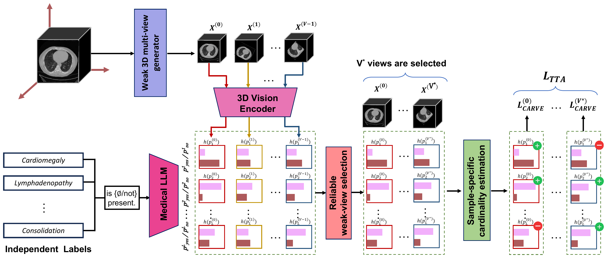

# CARVE: Cardinality-Aware Retained-View Entropy for Test-Time Adaptation of Zero-Shot 3D CT VLMs



Test-time adaptation for zero-shot prompt-pair multi-label 3D CT vision-language
models

## Installation

```bash
conda create -n carve python=3.10 -y && conda activate carve
pip install -r requirements.txt
pip install -e third_party/transformer_maskgit
pip install -e third_party/CT_CLIP
```

## Models and data

- CT-CLIP checkpoints (Zero-shot / VocabFine / ClassFine):
  `python scripts/download_ctclip_weights.py` (then pass with `--weights`).
- fVLM (optional backbone): install `salesforce-lavis`, place the fVLM weights
  (`model.pth`) and text encoder under a directory and set `FVLM_ROOT`.
- Datasets: CT-RATE (internal), RAD-ChestCT, CC-CCII, LUNA16. Data roots and
  label CSVs are passed via CLI flags (see below).

## Usage

CT-CLIP test-time adaptation on one cohort:

```bash
python src/carve_xview_adapt.py \
  --weights <ctclip_ckpt.pt> --dataset radchest \
  --radchest_root <data_root> --test_csv <labels.csv> --metadata_csv <meta.csv> \
  --target_d 240 --num_views 8 --keep_frac 0.25 --lambda_neg 0.8 --lr 1e-5 --steps 2 \
  --methods zeroshot,tent,ml_tta,bem,carve_xview,carve_xview_gate \
  --seed 0 --num_shards 1 --shard_idx 0 --out_dir results_radchest
```

`--dataset` accepts `radchest`, `ctrate`, `luna`, `ccii`.

fVLM backbone:

```bash
FVLM_ROOT=<fvlm_dir> python src/fvlm_endtask_adapt.py \
  --dataset radchest --labels_csv <labels.csv> --meta_csv <meta.csv> \
  --radchest_root <data_root> \
  --methods zeroshot,tent,ml_tta,bem,carve_xview,carve_xview_gate \
  --out_dir results_fvlm
```

Aggregate sharded predictions and compute metrics:

```bash
python analysis/carve_xview_merge_shards.py --endtask_dir results_radchest   # if sharded
python analysis/metrics_full.py                                     # AUROC/AUPRC/F1/P/R/Acc
```

SLURM array-job templates are in `scripts/` (edit the data/weight paths for your
environment).

## CARVE flags

`--num_views` V, `--keep_frac` rho, `--lambda_neg`, `--card_mode {sum_round,oracle,gap,fixed}`,
`--gate_tau` (CARVE-Gated), `--adapt_target`, `--target_d {40,240}`.

## Repository layout

```
src/
  carve_xview.py               CARVE cardinality-aware objective
  carve_xview_adapt.py         CT-CLIP TTA driver
  fvlm_endtask_adapt.py        fVLM TTA driver
  fvlm_wrapper.py              fVLM model loader
  ctclip_zeroshot_official.py  native-depth (z=240) preprocessing
  pipeline/                    RAD-ChestCT / CT-RATE data loader
  pipeline_luna/  pipeline_ccii/   dataset-specific loaders
scripts/                       run scripts, weight download
analysis/                      shard merge, metric tables, figures
third_party/
  CT_CLIP/  transformer_maskgit/   model packages (editable installs)
```

## Citation

```bibtex
@inproceedings{carve,
  title={When Can Test-Time Adaptation Help Zero-Shot CT Vision-Language Models?},
  author={},
  booktitle={},
  year={}
}
```
